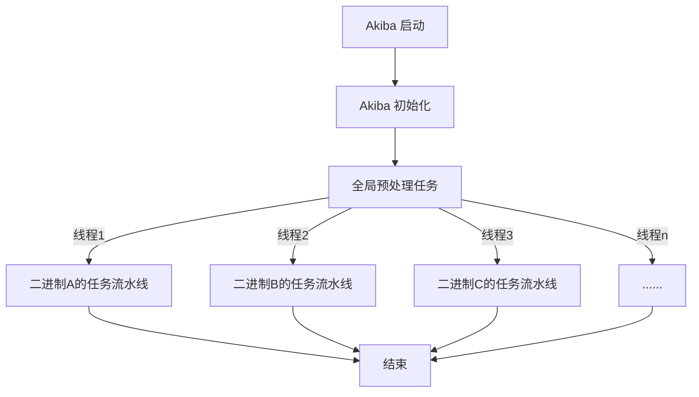
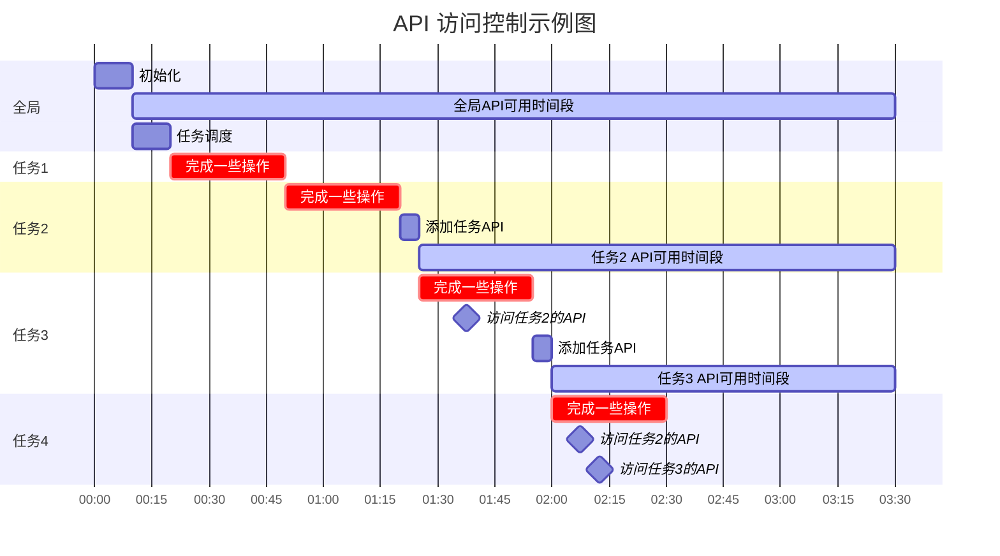

# Akiba 框架

## 1. 配置文件

### `config.json` 主配置文件

**你需要填充主配置文件中必须填充的一些配置，以使 Akiba 正常运行。**

配置文件示例：

```text
{
  // metadata: 本次任务的主要信息，目前不要求填充，也没有实际意义
  "metadata": {
    "description": "Akiba Test"
  },
  // main: 主要配置，实际上该配置可以随意修改路径，在框架的 -c 参数中指定正确的文件与文件内 JSON 路径即可。
  // 如假设该文件名为 config.json，则 -c 填充 config.json@main。默认配置即为 configs/config.json@/main
  // 注意：JSON 路径为 Jackson 格式，即以 "/" 分隔，与文件名类似。
  "main": {
    // username: 用户名，不是 Linux 用户
    "username": "akiba",
    // password: 用户密码
    "password": "akiba",
    // usingInstance: 使用的数据库实例名称，Akiba 支持多数据库实例保存数据
    "usingInstance": "akiba",
    // globalConsoleLogLevel: 全局控制台日志等级。可选值：OFF，TRACE，DEBUG, INFO, WARN, ERROR。
    "globalConsoleLogLevel": "INFO",
    // globalFileLogLevel: 全局文件日志等级。可选值：OFF，TRACE，DEBUG, INFO, WARN, ERROR。
    "globalFileLogLevel": "INFO",
    // llm: LLM 配置，用于 agent 支持
    "llm": {
      // provider: LLM 提供者 (DEEP_SEEK, OPEN_AI, ANTHROPIC, GEMINI, OLLAMA 等)
      "provider": "DEEP_SEEK",
      // modelName: 使用的模型名称
      "modelName": "deepseek-v4-flash",
      // apiKeyEnv: 包含 API 密钥的环境变量名
      "apiKeyEnv": "DEEPSEEK_API_KEY",
      // baseUrl: (可选) OpenAI 兼容 API 的基础 URL
      "baseUrl": null
    },
    // general: 通用配置
    "general": {
      // binariesRoot: 二进制文件根目录。Akiba 在导入文件时，会将文件复制到指定目录，并统一命名为 <id>.bin。这里指定的是复制的目标目录。
      "binariesRoot": "/data/binaries",
      // importRoot: (可选) 导入文件的根目录。如果为 null，则使用 binariesRoot
      "importRoot": null,
      // processor: 缺省处理器架构，如果需要分析数据库中未知架构的文件，则默认使用该架构分析，默认为 n/a 时，会尝试使用多种常用架构分析。
      "processor": "n/a",
      // autoAnalysisTimeout: Ghidra 的单次最大自动分析时间（秒）。
      "autoAnalysisTimeout": 600,
      // threads: 最大并发线程数，指最大可并发处理的二进制文件数量。
      "threads": 1
    },
    // withGhidraProject: Ghidra 项目配置
    "withGhidraProject": {
      // projectRoot: Ghidra 项目根目录。在这里保存 Ghidra 项目文件。
      "projectRoot": "./ghidra_projects",
      // name: Ghidra 项目名称。
      "name": "analyzed_base_2",
      // mode: 创建 Ghidra 项目的模式，可选值：new, fork, base。
      //       new: 新建项目。
      //       fork: 复制已有项目并在该项目基础上继续，指定为 fork 时，name 为原项目名，必须指定 forkTo。
      //       base: 直接在已有项目基础上继续，指定为 base 时，name 为原项目名，必须指定本次任务的日志名 continueLog
      "mode": "new",
      // forkTo: 创建项目时，指定为 fork 时，name 为原项目名，必须指定 forkTo（复制的目标项目名）。
      "forkTo": null,
      // forkOnTask: 是否为每个任务 fork 一个新的 Ghidra 项目。默认为 false。
      "forkOnTask": false,
      // continueLog: 创建项目时，指定为 base 时，name 为原项目名，必须指定本次任务的日志名 continueLog。
      "continueLog": null,
      // overwriteLog: 是否覆盖已有日志文件。如果已有日志文件且 overwriteLog 被设置为 false，Akiba 则会拒绝开始任务。
      "overwriteLog": true,
      // overwriteProject: 当同名 Ghidra 项目存在时是否覆盖。默认为 false。
      "overwriteProject": false,
      // deletePreviousProgram: 是否在分析前删除之前的 Ghidra 程序。默认为 false。
      "deletePreviousProgram": false,
      // saveProject: 是否保存 Ghidra 项目。如果设置为 false，则 Ghidra 项目会在任务全部完成后删除。
      "saveProject": true,
      // noCreateProgram: 是否为待分析二进制文件自动创建 Ghidra Program。Ghidra Program 是二进制分析的基础，
      //                  当不需要借助 Ghidra Program 分析时（如简单计算文件熵值），可设置为 true 以减少不必要的步骤。
      "noCreateProgram": false
    },
    // sqlSource: 数据库配置
    "sqlSource": {
      // serverIP: Akiba 数据库守护程序 IP
      "serverIP": "127.0.0.1",
      // serverPort: Akiba 数据库守护程序端口，默认为 31777
      "serverPort": "31777",
      // useSnapshot: 指定使用的数据库快照。目前该功能尚未支持，保留。
      "useSnapshot": "current",
      // constraint: ID 筛选约束。默认为空，表示分析数据库中的所有文件。也可填入 SQL 语句片段，如 "WHERE u.ID < 100"
      //             该片段与 "SELECT u.ID FROM using_binaries u" 拼接。
      "constraint": "",
      // disableUpdate: 是否禁用数据库更新。如果设置为 true，则 Akiba 在本次任务中将不会更新数据库。（该功能尚未测试）
      "disableUpdate": false,
      // useLocalCache: (可选) 使用本地缓存数据库替代远程 daemon。null 表示禁用。
      "useLocalCache": null
    },
    // globalPreTasks: 全局预处理任务，在二进制特定任务之前运行一次
    "globalPreTasks": [],
    // packages: (可选) 脚本执行需要导入的 Maven 包
    "packages": null,
    // dbImports: 数据库导入配置
    //            有时一个模块需要其他模块的输出结果，可以在导入配置文件中指定导入的数据表。
    //            在单文件流水线分析中，该部分数据的 key 将会以 "数据名+.+列名" 的形式保存。如 "test_results.function_number"
    "dbImports": [
      "test_results"
    ],
    // tasks: 任务配置
    "tasks": [
      {
        // mainClassName: 模块主类完整路径。模块主类必须继承 AkibaModule 类，模块文件名以amod开头，需保存在 modules 目录中。
        //                Akiba 通过获取主类信息搜索模块，并在分析开始前将全部所需类一同加载。
        "mainClassName": "org.iotsplab.akiba.process.TestModule",
        // configKey: 模块配置文件路径。该文件将作为模块的参数，模块主类将获取该文件并解析为 JSON 对象。
        //            可以将主配置文件与模块配置文件写在同一个文件内，使用不同的 JSON 路径加以区分。
        //            写在同一文件中时，可以以 "@@<路径>" 简写。
        "configKey": "@@/TestModule",
        // consoleLogLevel: 控制台日志等级。可选值：off，trace，debug, info, warn, error。
        "consoleLogLevel": "debug",
        // fileLogLevel: 文件日志等级。可选值：off，trace，debug, info, warn, error。
        "fileLogLevel": "debug",
        // timeout: 模块执行超时时间（秒）。超时后，Akiba 将会取消模块的运行。在模块内有 API 可决定模块超时后是否继续运行后续模块。
        "timeout": 600
      }
    ]
  },
  // TestModule: TestModule 模块配置，可以写在除该文件 /main 路径之外的任意位置，使用正确路径指定即可。
  "TestModule": {
    "name": "Akiba",
    "age": 18,
    "department": "CSE",
    "salary": 24000
  }
}
```

### `log4j2.xml` 日志配置

日志配置文件用于指定 Akiba 的主日志输出。在 Akiba 中，每个任务可以指定一个文件日志输出和一个控制台日志输出，在主配置文件中可以指定这两个日志输出的日志等级。

```xml
<?xml version="1.0" encoding="UTF-8"?>
<Configuration status="WARN">
    <Properties>
        <Property name="consolePattern">
             %msg%n
        </Property>
    </Properties>
    <Appenders>
        <Console name="Console" target="SYSTEM_OUT">
            <PatternLayout pattern="%d %highlight{%-5level}{ERROR=Bright RED, WARN=Bright Yellow, INFO=Bright Green, DEBUG=Bright Cyan, TRACE=Bright White} %style{[%t]}{bright,magenta} %style{%c{1.}.%M(%L)}{cyan}: %msg%n"/>
        </Console>
    </Appenders>
    <Loggers>
        <Root level="info">     <!-- change here for root logger -->
            <AppenderRef ref="Console"/>
        </Root>
    </Loggers>
</Configuration>
```

### `import-example.json` 导入配置文件

导入配置文件用于 Akiba 的文件导入任务，可以用于批量导入二进制文件，下面是一个示例文件。

```json
{
  "entries": [
    {
      "path": "imported/binaryfile.bin",
      "property_1": "aaa",
      "property_2": "bbb"
    }
  ]
}
```

如果要添加文件或文件夹（如果导入文件夹则认为文件夹内所有文件均为待导入的二进制文件），需要在导入配置中添加一个条目。`path`用于指定文件路径，必填；`arch`选填，用于指定文件架构，当 Ghidra 无法判断二进制文件的架构时，将使用导入配置文件中的`arch`为架构进行分析，如果`arch`没有指定，则导入的二进制文件架构将由 Ghidra 与 Akiba 自动判断，在 Ghidra 无法判断时，Akiba 将尝试判断，如果二者均失败，则该二进制文件的架构会被记录为`n/a`。除了上述两个字段外，你还可以随意添加其他的字段，这部分字段将会保存在数据库的 `global_data` 中，可供分析该二进制文件的所有任务读写。

注意：**所有添加的路径都必须是主配置文件中设置的根目录的相对路径（`config.json` 中的 `general.binariesRoot`）**

## 2. 任务协程

Akiba 主要服务于**大规模二进制文件分析任务**，每个二进制文件都会启动一个任务流水线。整体流程如下：



二进制文件的分析任务通过协程控制，其最大并行数量由主配置文件中的 `general.threads` 控制。每个任务流水线都包含多个由 `AutoProcess` 子类定义的任务构成，可以按照任意顺序排列。

如果你需要改变任务的执行顺序或禁用某些子进程，你可以在主配置文件中配置 `procedures`。详见 `config.json` 中的注释说明。

为了使不同的任务之间便于交互，Akiba 为每个任务都创建了 2 个协程上下文，1 个用于全局作用域，另一个用于流水线作用域。全局作用域下的 API 可以被所有任务访问，而某个二进制文件的流水线作用域下的 API 只能被分析该二进制文件的任务流水线中的任务访问。



如上图所示，对于子进程 2，它生成的流水线作用域 API 只能被子进程 2 及之后的任务访问。

### 如何添加API

使用注解 `GlobalLateinitInterface` 来标记方法。

对于全局预处理任务，这些方法将添加到全局作用域协程上下文中，你可以使用 `coroutineContext[GlobalContextKey]!!.call(method, *args)` 来调用。

对于流水线任务，这些方法将添加到流水线作用域协程上下文中，你可以使用 `coroutineContext[TaskContextKey]!!.call(method, *args)` 来调用。

`HTTPServer` 类可以注册所有带有 `GlobalLateinitInterface` 注解的方法，这样 web 服务器方法就可以被访问，因此你也可以在 `DynamicServer` 的子类中使用 `GlobalLateinitInterface`。

**注意：所有 API 必须单例访问！**

## 3. 任务数据处理

Akiba 允许任务通过多种方式处理数据，包含多个数据来源。

### 3.1 需要保存到数据库的数据

每个二进制文件在数据库中都有一个独特的ID，在 `results` 表中，列 `global_data` 用于保存数据。数据在这里可以通过任务写入，也可以由用户随意修改。它是一个 JSON 字符串，在任务中通过 JSON 路径解析。

注意：一个任务不能访问其他二进制文件的 `global_data`，它只能读取它分析的二进制文件的对应数据。

### 3.2 临时数据

在流水线分析过程中，一些数据可能不需要保存在数据库中，Akiba 提供了两个 API 来让任务能够读取或写入临时数据，保存在流水线作用于的一个 `HashMap<String, Any?>` 中：

- `getTaskData(key: String?)`: 返回给定 key 的数据，如果 key 为空，则返回所有数据
- `setTaskData(key: String, value: Any?)`: 设置给定 key 的数据。

如果你的任务需要访问临时数据，建议使用注解类 `DataConsumer` 来指定需要的 key 和类型。相反，如果你的任务需要提供数据给其他任务，你可以使用注解类 `DataProducer` 来指定你的任务可以提供的数据的 key 和类型。

### 3.3 任务专用数据

如果你需要运行很多任务，并且不想将数据混合在一起保存在 `global_data` 中，你可以定义任务专用数据，通过注解类 `DatabaseColumn` 来指定你的任务需要定义的数据的 key 和类型。也就是说，每个任务都可以有自己专用的数据表，结构完全可以自定义。

目前，数据库只支持几种数据类型：
- `text`：输入数据应该能够转换为 `String`
- `integer`：输入数据应该能够转换为 `Long`
- `double precision`：输入数据应该能够转换为 `Double`
- `bytea`：输入数据应该能够转换为 `ByteArray`
- `timestamptz`：输入数据应该能够转换为 `LocalDateTime`
- `jsonb`：输入数据应该能够转换为 `JsonElement`
- `boolean`：输入数据应该能够转换为 `Boolean`
- `uuid`：输入数据应该能够转换为 `UUID`
- `interval`：输入数据应该能够转换为 `Duration`

APIs:
- `createDatabase`：创建任务专用数据库，这个方法不需要被显式调用，在每个任务实例化时会被调用，所以不需要手动调用。
- `updateData`：向任务专用数据库更新数据。对于给定 ID 的二进制文件，该任务只能更新该二进制文件的对应数据。如果数据库中不存在该 ID，则创建一个新的条目并更新，否则替换旧数据。
    - 注意：`updateData`采用安全方式实现，不会造成SQL注入。

### 3.4 任务保留数据

在数据表创建时，除用户需要的数据列，Akiba 还会添加一些列用于保存运行时信息：

- `id`：二进制文件的 ID
- `start_timestamp`：该二进制文件的该任务开始时间（类型为`timestamptz`）
- `finish_timestamp`：该二进制文件的该任务结束时间（类型为`timestamptz`）
- `execute_time`：该二进制文件的该任务执行时间（类型为`interval`）
- `err_msg`：该二进制文件的该任务错误信息（类型为`text`）

Akiba 提供了 API 来让任务能够保存错误信息。任务可以通过 `updateErr` 来更新错误信息。错误信息保存在各模块数据表中的列 `err_msg` 中。

### 3.5 总结

总的来说，Akiba 目前支持多种类型的数据更新，但时刻牢记一个关键：**流水线作用域**。因为每个二进制文件都有一个唯一的ID，对于所有处理某个二进制文件的任务，该任务能够且只能够控制该二进制文件的所有数据，这样可以保证任务不能影响其他二进制文件的分析数据。

## 4. 日志文件

Akiba 将不同二进制文件、不同模块产生的日志分开保存，便于任务运行完成后查阅与调试。

日志文件统一保存在 Akiba 根目录的 `log` 目录下，在任务开始时，Akiba 将创建本次任务的日志根目录，目录名由主配置的 `withGhidraProject` 中的相关配置指定。通常情况下，一次任务运行结束后，该日志目录下的文件结构大致应为：

```text
<log root>
    Root.log                // 根日志文件，保存根日志
    config.json             // 本次任务的配置文件。如果任务开始时指定的配置位于多个配置文件中，Akiba 将会将这些配置文件合并为一个文件保存
    properties.json         // 本次任务的目标二进制文件的相关数据
    <failed>                // 运行失败的二进制文件
        <1>                 // 编号为 1 的二进制文件分析流水线的日志目录
            Module1.log     // 模块 Module1 在分析编号为 1 的二进制文件时产生的日志
            Module2.log     // 模块 Module2 在分析编号为 1 的二进制文件时产生的日志
        <2>
            Module1.log
            Module2.log
    <runtime_error>         // 分析时出现运行时错误的二进制文件
        <3>
            ...
    <success>               // 分析成功完成的二进制文件
        <4>
            ...
        ...
```

## 5. 脚本文件

### starter.py

一个脚本，用于监控 Kotlin 进程的执行，当日志文件没有更新超过 20 分钟（可配置）时，它将重新启动并恢复进程（自动进行断点续传）。
所有 Akiba 需要的参数都可以在脚本中指定。
温馨提示：在 Linux 中，你可以在命令行中添加一个 `&` 来在后台运行该命令。例如：`python3 starter.py &`

## 6. LLM Agent 系统

### 概述

Akiba 提供了内置的 LLM agent 基础设施，用于智能二进制分析。Agent 系统允许你创建使用大型语言模型进行逐步推理分析二进制的模块。

### Agent 策略

#### ReAct 策略（默认）

ReAct（推理 + 行动）策略遵循显式的 **Thought → Action → Observation** 循环：

```
THOUGHT: 我需要找到入口点。
ACTION:  list_functions()
OBSERVATION: main @ 0x401234, foo @ 0x401256
THOUGHT: 入口点是 main...
ACTION:  decompile(address="0x401234")
OBSERVATION: int main() { return 0; }
THOUGHT: 我现在有答案了。
FINAL ANSWER: 二进制的入口点...
```

#### Plan-Execute 策略

Plan-Execute 策略分三个阶段工作：

1. **规划**：创建编号的步骤计划
2. **执行**：执行每个步骤并收集观察结果
3. **反思**：反思结果并给出最终答案

### 创建 Agent 模块

继承 `AgentModule` 来创建 agent 驱动的分析模块：

```kotlin
@WithAgentSystemPrompt("You are a binary analysis assistant.")
@WithAgentMaxIterations(15)
@WithTableColumn("analysis", "TEXT")
@WithTableColumn("iterations", "INTEGER")
class BinaryAnalyst(
    configPath: String? = null,
    id: Int,
    program: Program?,
    consoleLogLevel: Level = Level.INFO,
    fileLogLevel: Level = Level.INFO
) : AgentModule(configPath, id, program, consoleLogLevel, fileLogLevel) {

    override fun defineTools(): List<Tool> = listOf(
        tool("list_functions") {
            description = "List all functions in the binary"
            execute { args ->
                program?.let { p ->
                    p.functionManager.getFunctions(true)
                        .take(50).joinToString("\n") { "${it.name} @ ${it.entryPoint}" }
                } ?: "No program loaded"
            }
        }
    )

    override fun taskPrompt(): String =
        "Analyze this binary and identify its purpose, entry point, and key functions."
}
```

### 内置工具

使用 `AgentModule` 时，以下内置工具自动可用：

| 工具名称 | 描述 | 参数 |
|---------|------|------|
| `run_module` | 在当前或不同二进制文件上运行另一个 AkibaModule | `className` (必需), `targetId`, `configJson`, `timeout`, `skipDbWrite` |
| `spawn_sub_agent` | 异步生成子 LLM agent（模板路径或自由路径），立即返回 handle | `templateId` 或 `systemPrompt`+`taskPrompt`, `inputs`, `overrides`, `toolNames`, `maxIterations` |
| `await_agent` | 等待单个子 agent 达到目标状态 | `childId` (必需), `until`, `timeoutMs`, `pollMs` |
| `await_multiple_children` | 批量等待多个子 agent（任一完成或全部完成即返回） | `childIds` (必需), `mode` (any/all/any_idle/all_idle), `until`, `timeoutMs`, `pollMs` |
| `query_module_data` | 从数据库查询分析结果 | `tableName` (必需), `columns` |
| `query_session_history` | 查看过去的 agent 会话或获取消息 | `sessionId`, `binaryId`, `limit` |
| `query_memories` | 搜索长期记忆存储 | `sessionId`, `memoryType`, `key`, `minImportance`, `limit` |
| `list_modules` | 列出所有可用的 AkibaModules | (无) |
| `run_script` | 动态编译并运行 Kotlin 脚本 | `source` (必需), `className`, `targetId` |
| `query_ghidra_api` | 搜索和阅读 Ghidra API 文档 | `action` (必需, search/read_class), `keyword` (必需), `maxResults` |
| `run_shell` | 在工作空间执行 shell 命令 | `command` (必需), `timeout`, `workDir` |

#### run_module

运行另一个 AkibaModule 并返回其结果。模块必须是完全限定的类名。

```json
{
  "className": "org.example.DecompileModule",
  "targetId": 123,
  "configJson": "{\"option\":\"value\"}",
  "timeout": 300,
  "skipDbWrite": false
}
```

#### spawn_sub_agent

异步生成子 LLM agent 并立即返回 handle（用于后续 `await_agent`）。

模板路径（推荐）：

```json
{
  "templateId": "binary_crypto_worker",
  "inputs": { "addressRange": "0x401000-0x402000" },
  "name": "crypto-sweep"
}
```

自由路径（不依赖模板）：

```json
{
  "systemPrompt": "You are a decompilation specialist.",
  "taskPrompt": "Decompile the main function",
  "toolNames": "run_script,query_ghidra_api",
  "maxIterations": 10
}
```

#### query_ghidra_api

在编写脚本之前搜索 Ghidra API 文档。

```
action: "search"  → 查找匹配关键字的类/成员
action: "read_class"  → 阅读完整的类文档
```

示例工作流：
1. `query_ghidra_api {"action":"search", "keyword":"decompile"}`
2. `query_ghidra_api {"action":"read_class", "keyword":"DecompInterface"}`
3. 在 `run_script` 中使用发现的 API

### Agent 配置

LLM 配置可以通过两种方式指定：

**1. 全局配置（configs/config.json）：**

```json
{
  "llm": {
    "provider": "DEEP_SEEK",
    "modelName": "deepseek-v4-flash",
    "apiKeyEnv": "DEEPSEEK_API_KEY",
    "baseUrl": null
  }
}
```

**2. 程序化覆盖：**

```kotlin
class MyAgent(...) : AgentModule(...) {
    override fun agentLLMConfig(): LLMConfig = LLMConfig(
        provider = LLMProvider.OLLAMA,
        modelName = "qwen3.6",
        apiKey = "ollama",
        baseUrl = "http://localhost:11434"
    )
}
```

### LLM 提供者

Akiba 支持以下 LLM 提供者：

| 提供者 | 显示名称 | OpenAI 兼容 |
|-------|---------|------------|
| `OPEN_AI` | OpenAI | 否 |
| `ANTHROPIC` | Anthropic | 否 |
| `GOOGLE_GEMINI` | Google Gemini | 否 |
| `MISTRAL` | Mistral AI | 否 |
| `OLLAMA` | Ollama | 否 |
| `AZURE_OPEN_AI` | Azure OpenAI | 否 |
| `DEEP_SEEK` | DeepSeek | 是 |
| `MOONSHOT` | Moonshot / Kimi | 是 |
| `ZHIPU` | Zhipu AI / ChatGLM | 是 |
| `QWEN` | Qwen / DashScope | 是 |
| `OPEN_AI_COMPATIBLE` | OpenAI 兼容 | 是 |

### LLM 配置选项

`configs/config.json` 中的 `llm` 部分支持以下选项：

```json
{
  "llm": {
    "provider": "DEEP_SEEK",
    "modelName": "deepseek-v4-flash",
    "apiKeyEnv": "DEEPSEEK_API_KEY",
    "apiKey": "your-api-key",
    "baseUrl": null,
    "temperature": null,
    "topP": null,
    "maxTokens": null,
    "timeoutSeconds": 120,
    "maxRetries": 3,
    "debugLogging": false
  }
}
```

| 参数 | 类型 | 默认值 | 描述 |
|------|------|-------|------|
| `provider` | string | (必需) | LLM 提供者名称 (OPEN_AI, DEEP_SEEK 等) |
| `modelName` | string | (必需) | 模型标识符 |
| `apiKeyEnv` | string | | 包含 API 密钥的环境变量名 |
| `apiKey` | string | | 直接 API 密钥（不推荐） |
| `baseUrl` | string | null | OpenAI 兼容 API 的基础 URL |
| `temperature` | double | null | 采样温度 (0.0-1.0) |
| `topP` | double | null | 核采样参数 |
| `maxTokens` | int | null | 响应最大 token 数 |
| `timeoutSeconds` | int | 120 | 请求超时时间（秒） |
| `maxRetries` | int | 3 | 失败重试次数 |
| `debugLogging` | boolean | false | 启用详细的请求/响应日志 |

### 记忆系统

Akiba agent 有两种类型的记忆：

1. **聊天记忆**：对话历史，支持滑动窗口退出
   - 持久化（数据库支持）或内存中
   - 通过 `usePersistentMemory()` 和 `maxMemoryMessages()` 配置

2. **认知记忆**：用于洞察和发现的长期记忆存储
   - 按会话存储在数据库中
   - 自动记住重要的工具结果
   - 可通过 `query_memories` 工具搜索

